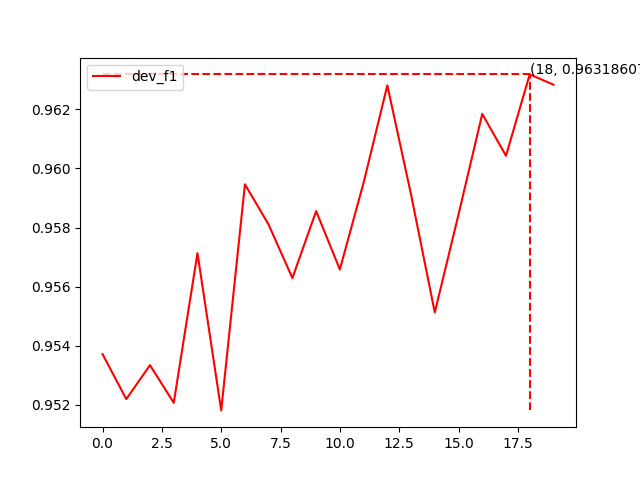
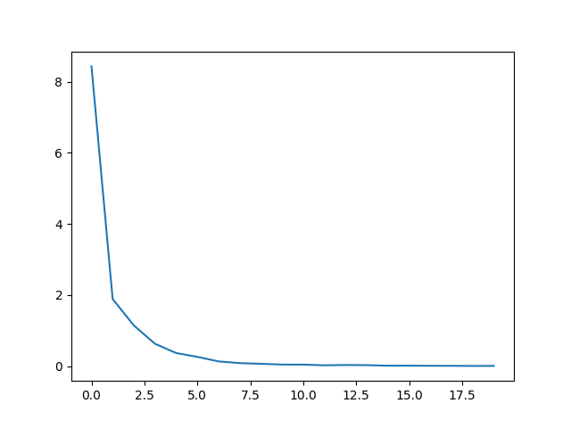
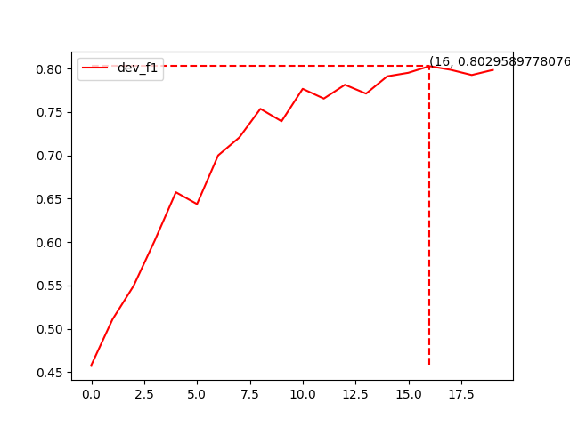
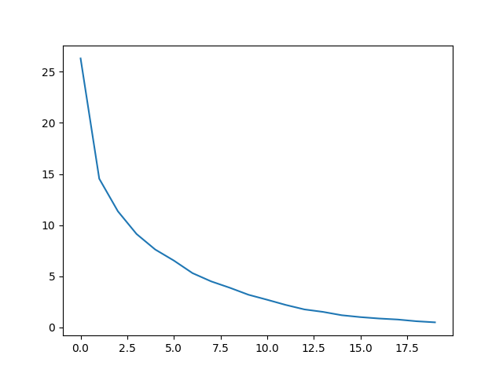
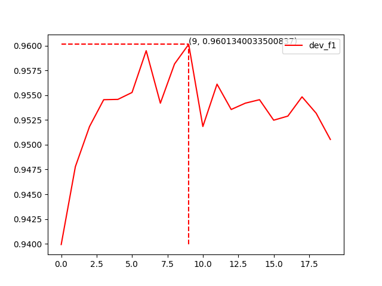
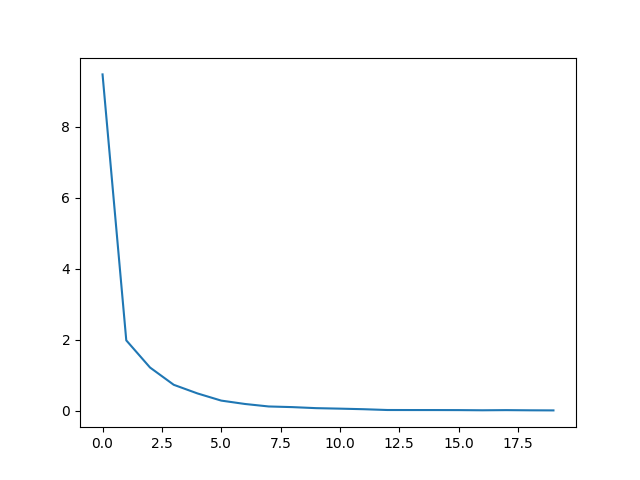
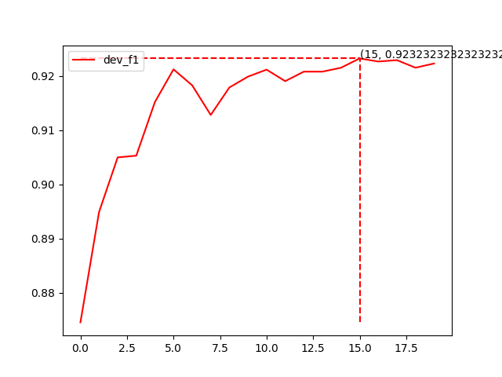
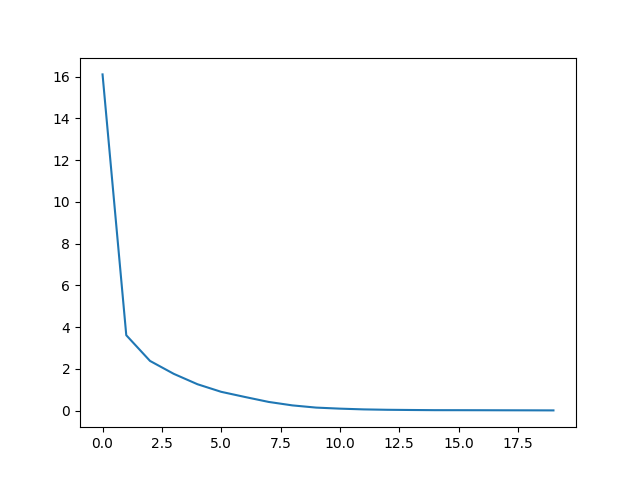

中文NER命名实体识别，Bert, RoBerta，基于pytorch，开箱即用。

## 中文数据集 CNER
类别：NAME,CONT,RACE,TITLE,EDU,ORG,LOC,PRO 8大类，再按BI标记,加上start、end、pad、O实际共20类

# 原始数据样例格式
```
高 B-NAME
勇 E-NAME
： O
男 O
， O
中 B-CONT
国 M-CONT
国 M-CONT
籍 E-CONT
， O
无 O
境 O
外 O
居 O
留 O
权 O
， O

1 O
9 O
```
# 转换格式为csv
好多数据都是这样的txt格式，然后按标点或者空格划分，统计起来不清晰，所以通过txt2csv.py转换成csv格式如下

| sen | label_decode | label(前后加了[bos]和[sep]的label(也就是'O'的label(5))) | raw_sen | length
| ---- | ---- |---- |---- |---- |
"['高', '勇', '：', '男', '，', '中', '国', '国', '籍', '，', '无', '境', '外', '居', '留', '权', '，']"|"['B-NAME', 'I-NAME', 'O', 'O', 'O', 'B-CONT', 'I-CONT', 'I-CONT', 'I-CONT', 'O', 'O', 'O', 'O', 'O', 'O', 'O', 'O']"|"[5, 3, 4, 5, 5, 5, 6, 7, 7, 7, 5, 5, 5, 5, 5, 5, 5, 5, 5]"|高勇：男，中国国籍，无境外居留权，|17


# 目录结构
```
bert_crf_token_classification_raw/
├── data # 放数据
│   ├── med_data #放数据
│   │    ├── dev_f1.png # 训练时产生, 训练集、验证集正确率曲线
│   │    ├── loss.png # 训练时产生, loss下降曲线
│   │    ├── test_data_predict.csv # 行test.py得到的对test.csv的预测结果
│   │    ├── label_2_id.json # 标签对应id，运行data/txt2csv.py可以产生
│   │    ├── train.char.bmes # 原始训练数据,运行data/txt2csv.py变成train.csv
│   │    ├── test.char.bmes  # 测试数据,运行data/txt2csv.py变成test.csv
│   │    ├── test.char.bmes  # 测试数据,运行data/txt2csv.py变成dev.csv
│   │    ├── train.csv  # 训练数据
│   │    ├── test.csv  # 测试数据
│   │    └── dev.csv  # 验证数据
│   └─ models  # 训练中会产生模型存放在这里
├── config.py  # 配置文件
├── dataset.py # pytorch 文本数据整理成bert输入dataloader 
├── infer.py # 训练完成后,运行这个可以终端输入文本，输出结果 直接测试,并且这个文件不依赖其他文件，如果只用在预测，可以拷走这个文件和模型文件在里面配一下模型文件地址即可
├── model.py # 放写模型的代码
├── test.py # 对test.csv文件的整体测试结果,增加一列预测结果，保存到csv文件，文件位置在config.py中配置
├── train.py # 训练
└── utils.py  # 小的工具函数
```

# 更换自己的数据集
1、在data下建立和med_data一样的文件夹（包含train.csv,test.csv,dev.csv,label2id.json)

2、在config.py中修改dir_name

# bert 训练曲线(20epoch)

model   |  acc             |  loss
:-------------------------:|:-------------------------:|:-------------------------:
bert |   |  
roberta |   |  
ernie  |   |  
albert  |   |  

# 具体参数可看config.py
```
# 训练
python train.py  # 会生成data/med_data/dev_f1.png,data/med_data/loss.png,正确率和loss曲线
# 终端直接输入文本测试
python infer.py # 里面参数需要重新配置，不导入config
# test.csv测试
python test.py  # 会生成data/med_data/test_data_predict.csv
``

